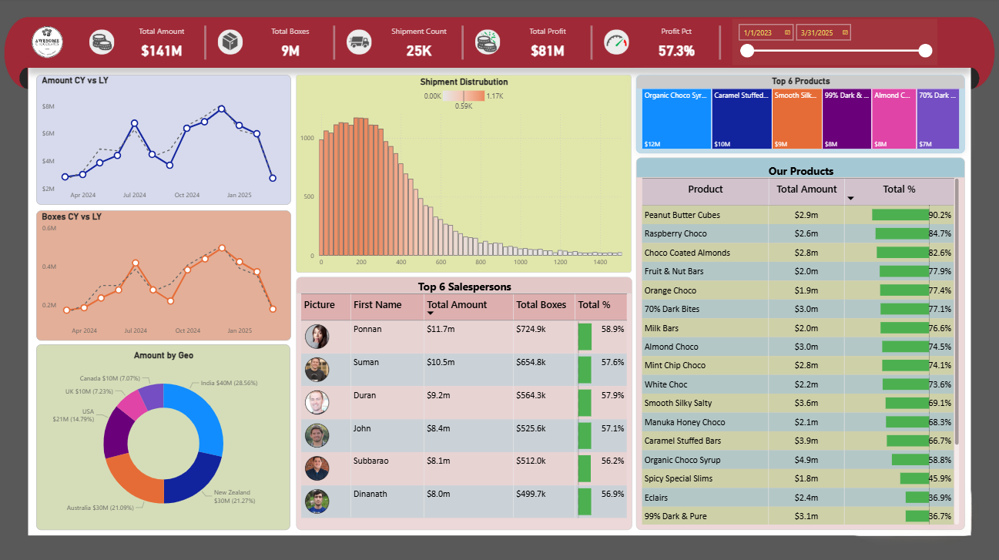

# 📊 Sales & Shipment Analytics Dashboard using Power BI

## 📌 Project Overview
This project focuses on analyzing shipment and sales operations to uncover revenue patterns, product performance, and regional trends.

The dashboard was built using Power BI, applying data modeling, DAX calculations, and interactive visuals to support faster and smarter business decisions.

## 📷 Dashboard Preview

## 🎯 Objectives
- Monitor overall sales and shipment KPIs  
- Compare current results vs last year  
- Identify top-performing products  
- Analyze geo contribution  
- Track salesperson effectiveness  
- Understand shipment volume distribution  

## 🗂 Dataset Architecture
The model follows a fact & dimension approach similar to enterprise BI systems.

### 🚚 Shipments (Fact)
- ShipmentID  
- SPID  
- PID  
- GID  
- Shipdate  
- Amount  
- Boxes  
- Order_Status  

### 📦 Products
- Product  
- Category  
- Cost_per_box  
- PID  

### 🌍 Geography
- Geo  
- Region  
- GID  

### 👨‍💼 Salesperson
- Sales_person  
- Team  
- Picture  
- SPID  

### 📅 Calendar
- cal_date  
- Month_num  
- month_name  
- year  
- weekday_num  
- weekday_name  

## 🧹 Data Preparation & Transformation
- Validated foreign keys  
- Standardized data types  
- Enabled time intelligence  
- Structured tables for analytical performance  

## 🧠 Feature Engineering (Columns Added)
- Start of Month → monthly grouping  
- First Name → cleaner display in leaderboard  
- Cost → boxes × cost per box  
- Boxes (bins) → shipment size segmentation  

## 📐 DAX Measures & Calculations
- Total Amount  
- Total Boxes  
- Shipment Count  
- Total Cost  
- Total Profit  
- Profit Pct  
- Amount Per Box  
- Total Amount (Last Year)  
- Total Amount (12 Months Variance)  
- Total Boxes (Last Year)  
- Total Boxes (12 Months Variance)  
- Total % contribution  

## 📊 Executive KPIs
- Total Amount  
- Total Boxes  
- Shipment Count  
- Total Profit  
- Profit Pct  

## 📈 Visual Analytics
### Trend Comparison
Line charts compare current performance with last year and show monthly variance.

### Regional Revenue View
Donut chart visualizes contribution by geography.

### Shipment Pattern
Clustered columns using bins show how frequently each shipment size occurs.

### Sales Leaderboard
Interactive ranking with image, first name, total amount, total boxes, and revenue %.  
Values change based on slicer selections.

### Product Contribution
Ranked table and treemap highlight top-performing products.

## 🔍 Insights Generated
- Easy comparison of present vs past performance  
- Revenue dependency on certain products  
- Clear regional demand patterns  
- Sales performance shifts based on filters  
- Majority shipments fall into specific size ranges  

## 🛠 Technology Stack
- Power BI Desktop  
- Power Query  
- DAX  
- Excel  

## 💼 Business Impact
- Faster decision-making  
- Consistent KPI measurement  
- Identification of revenue drivers  
- Better target & incentive planning  
- Reduced manual reporting effort  

## 📂 Repository Includes
- Power BI report (.pbix)  
- Source dataset  
- Dashboard screenshots

## 📥 Download Report
You can download the PBIX file from this repository to explore the data model, relationships, and DAX measures.

## 👨‍💻 Author
Thirupal  
Junior Data Analyst  
Power BI | SQL | Python | Excel
